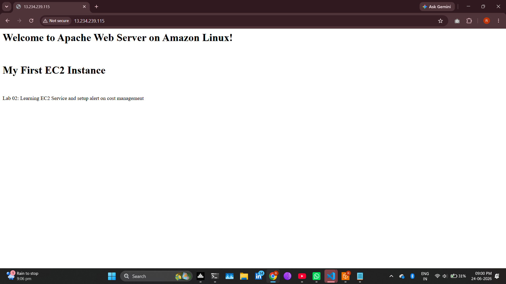

# Lab 02 A: Learning the EC2 Service & Setting Up Cost Management Alerts

## 1. Amazon EC2 Configuration

### Objective & Overview
The objective of this lab is to learn the fundamentals of the Amazon EC2 (Elastic Compute Cloud) service by launching, configuring, and deploying a web server on a virtual instance. 

> **Key Concept:** Amazon EC2 is a **Region-Specific** cloud service that provides resizable virtual servers (instances) to run applications securely and scalably.

---

### Deployment Actions Taken
A single EC2 virtual machine was successfully launched and configured with the following parameters:

* **Instance Name:** `MyFirstEC2Instance`
* **AMI (Amazon Machine Image):** Amazon Linux 2023 (Kernel 6.1)
* **Architecture:** 64-bit (x86)
* **Instance Type:** `t3.micro` *(Family: t3 | 2 vCPUs | 1 GiB Memory)*
* **Storage:** 1x 8 GiB gp3 Root volume (3000 IOPS, Not encrypted)
* **Network Settings:** Configured Security Groups to allow inbound HTTP traffic for web server accessibility.
* **Instance Count:** 1

### Bootstrap & User Data
A custom shell script was injected into the instance's User Data to automate the setup of an Apache web server upon boot. 

* **Full Script Source:** [script.sh](script.sh)

```bash
#!/bin/bash
sudo yum update -y

# Install Apache web server (httpd)
sudo yum install -y httpd
sudo systemctl start httpd
sudo systemctl enable httpd

# Create a simple HTML file to verify the web server is running
echo "<html>
<h1>Welcome to Apache Web Server on Amazon Linux!</h1>
<br> 
<h1>My First EC2 Instance</h1> 
<br><br>
Lab 02: Learning EC2 Service and setup alert on cost management 
</html>" > /var/www/html/index.html
```

### Verification
Once initialized, the web server successfully served the custom landing page over the public IP:



---

## 2. Infrastructure & Cost Management

To guarantee that this development environment remains entirely within the AWS Free Tier and avoids unexpected billing, strict financial and administrative controls have been implemented:

* **Near-Zero Spend Budget:** Configured an AWS Budget with a rigid **$0.01 threshold** to eliminate unexpected billing risks.
* **Proactive Alerts:** Integrated automated email notifications to alert project maintainers the moment actual or forecasted spend crosses the threshold.
* **IAM Compliance:** Strictly adhered to the **Principle of Least Privilege (PoLP)** during initial account setup, keeping root account access minimal and utilizing scoped IAM policies for service configuration.