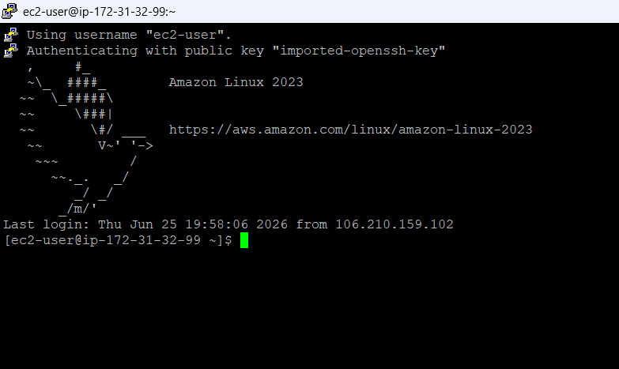

# Lab 02 B: Secure Remote Access via PuTTY & Web Server Source Customization

## 1. Overview
This lab covers Phase 2 of the AWS Cloud Infrastructure project. In the previous lab, we launched an Amazon Linux 2023 EC2 instance and got Apache (HTTPD) running on it. This time, the focus is on connecting to that instance securely from a Windows machine using PuTTY, and then editing the live website files directly on the server.

## 2. Environment Used
* **Cloud Provider:** AWS
* **Compute:** EC2
* **OS:** Amazon Linux 2023 (AL2023)
* **Remote Client:** PuTTY (Windows)
* **Key Format:** Converted `.pem` to `.ppk`
* **Web Server:** Apache (`httpd`)

---

## 3. Steps

### 3.1 Converting the Key File
1. Opened **PuTTYgen**.
2. Clicked **Load** and selected the `.pem` key file that AWS gave during instance creation.
3. Clicked **Save private key** to export it as a `.ppk` file (the format PuTTY actually understands).

### 3.2 Connecting Through PuTTY
1. Opened **PuTTY**.
2. Entered the EC2 instance's Public IPv4 address (or its public DNS) in the **Host Name** field.
3. Went to `Connection -> SSH -> Auth -> Credentials` in the side menu.
4. Clicked **Browse** and pointed it to the `.ppk` file from the previous step.
5. Clicked **Open**, then accepted the host key warning to start the session.

### 3.3 Logging In
PuTTY connected and authenticated using the key pair, landing in a terminal session as `ec2-user`:

```text
Using username "ec2-user".
Authenticating with public key "imported-openssh-key"
   ,     #_
   ~\_  ####_        Amazon Linux 2023
  ~~  \_#####\
  ~~     \###|
  ~~       \#/ ___   https://aws.amazon.com/linux/amazon-linux-2023
   ~~       V~' '->
    ~~~         /
      ~~._.   _/
         _/ _/
       _/m/'
Last login: Thu Jun 25 19:59:20 2026 from 106.210.159.102
[ec2-user@ip-172-31-32-99 ~]$

```


*Figure: Accessed via PuTTY.*

### 3.4 Editing the Website Files
Once logged in as `ec2-user`, the next step was to go into Apache's web folder and update the homepage.

Move into the web root:
```bash
cd /var/www/html/
```

Check what's already there:
```bash
ls -la
```

Open the homepage file for editing:
```bash
sudo nano index.html
```


Made the desired HTML changes (headers, layout, lab markers, etc.), then saved with **Ctrl+O** and exited with **Ctrl+X**.

```HTML
<!DOCTYPE html>
<html lang="en">
<head>
    <meta charset="UTF-8">
    <meta name="viewport" content="width=device-width, initial-scale=1.0">
    <title>Ritesh | AWS Cloud Security Labs</title>
</head>
<body>

    <header>
        <h1>AWS Cloud Security Labs</h1>
        <p>Hosted live on an EC2 instance running Apache (httpd) on Amazon Linux 2023.</p>
    </header>

    <hr>

    <section>
        <h2>About Me</h2>
        <p>I'm Ritesh, an aspiring Cloud Security Engineer building hands-on AWS labs to develop practical skills in cloud architecture, identity management, network hardening, and automation.</p>
    </section>

    <hr>

    <section>
        <h2>What This Server Demonstrates</h2>
        <ul>
            <li>Manual EC2 instance provisioning on Amazon Linux 2023</li>
            <li>Apache (httpd) web server installation and configuration</li>
            <li>Secure remote access via SSH key pairs (PuTTY)</li>
            <li>Live web content editing through the Linux CLI</li>
        </ul>
    </section>
    <hr>
    <footer>
        <p>Find the full lab documentation and source code on 
            <a href="https://github.com/Ritesh-Shinde45/AWS-Cloud-Security-Labs" target="_blank">GitHub</a>.
        </p>
    </footer>

</body>
</html>
```

## 4. Verification
* **SSH session:** Confirmed the connection on the correct instance (`ip-172-31-32-99`), matching the expected internal IP.
* **Live site check:** Opened the instance's Public IPv4 address in a browser and saw the updated homepage content load right away, confirming the changes.