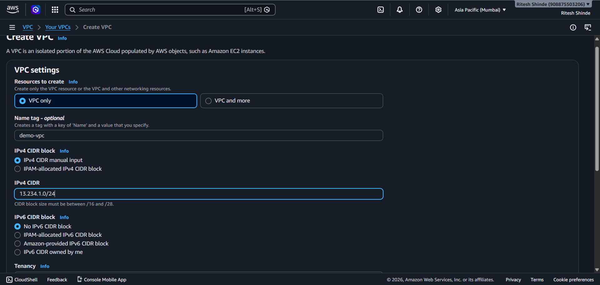
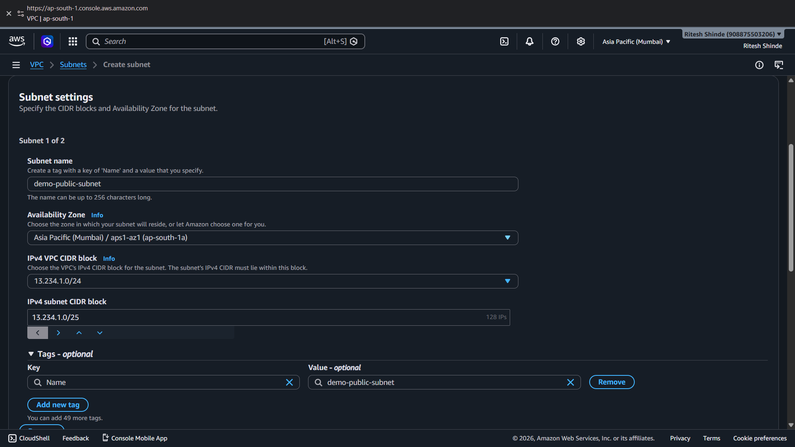
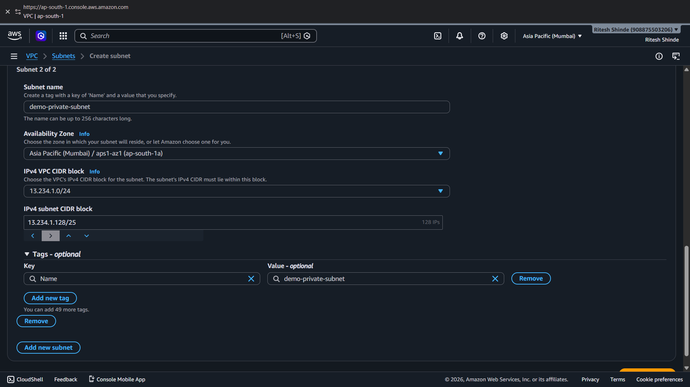
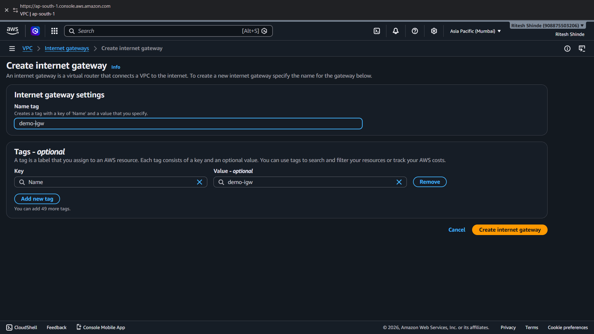
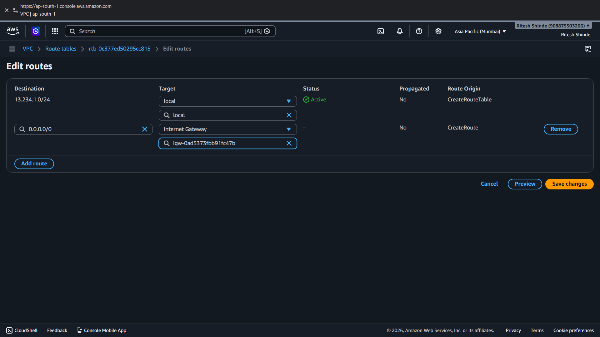
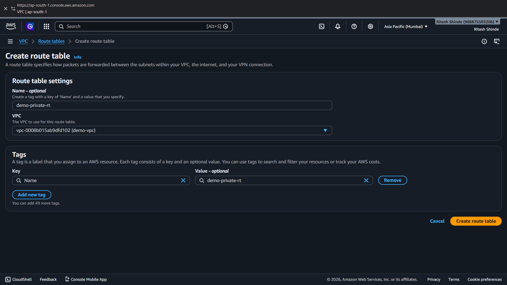
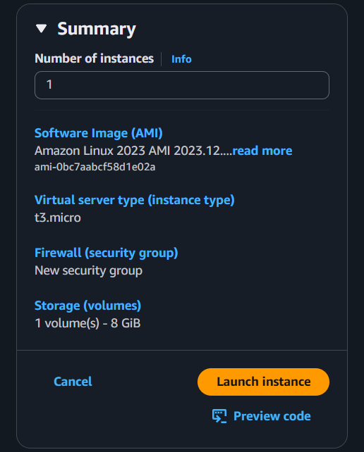

# Lab 03: Building a Custom VPC with Public and Private Subnets

## 1. Overview
This lab covers Phase 3 of the AWS Cloud Infrastructure project. So far I had been using the default VPC that AWS gives by default. In this lab I built my own VPC from scratch. I made a public subnet and a private subnet, set up an internet gateway, added route tables for both subnets and then launched a new EC2 instance inside the public subnet to check if everything works.

## 2. Environment Used
* **Cloud Provider:** AWS
* **Region:** Asia Pacific (Mumbai) `ap-south-1`
* **Availability Zone:** `ap-south-1a`
* **Compute:** EC2 (Amazon Linux, t3.micro)
* **Remote Client:** PuTTY (Windows)

---

## 3. Steps

### 3.1 Creating the VPC
Created a new VPC named `demo-vpc` with CIDR block `13.234.1.0/24`. This gives enough address space to split into a public subnet and a private subnet.

### 3.2 Creating the Public Subnet
Created `demo-public-subnet` with CIDR `13.234.1.0/25` in the `ap-south-1a` zone. This subnet will hold things that need direct internet access, like the EC2 instance.

### 3.3 Creating the Private Subnet
Created `demo-private-subnet` with CIDR `13.234.1.128/25`, also in `ap-south-1a`. This subnet is for things that should stay away from the internet.

### 3.4 Creating and Attaching the Internet Gateway
Created an internet gateway named `demo-igw` and attached it to `demo-vpc`. Without this attachment, the VPC has no way to reach the internet at all.

### 3.5 Creating the Public Route Table
Created a route table named `demo-public-rt` and linked it to `demo-public-subnet`. This table decides where traffic from the public subnet goes.

### 3.6 Editing the Public Route Table
Added a route inside `demo-public-rt`. Destination `0.0.0.0/0`, target `demo-igw`. This is the step that actually makes the subnet public, since now all outside traffic flows through the internet gateway.

### 3.7 Creating the Private Route Table
Created a second route table named `demo-private-rt` and linked it to `demo-private-subnet`. I did not add any internet gateway route here, so this subnet stays private.

### 3.8 Launching the Test Instance
Launched a new EC2 instance named `demo-instance` to test if the setup works.

**Settings used:**
* **AMI:** Amazon Linux
* **Instance type:** t3.micro
* **VPC:** demo-vpc
* **Subnet:** demo-public-subnet
* **Auto-assign public IP:** Enabled
* **Security group:** demo-instance-sg (new)
* **Inbound rule:** SSH (port 22), source Anywhere

---

## 4. Verification
After the instance was running, I connected to it through PuTTY using its public IP and the key pair I downloaded during launch. The connection worked on the first try. This confirmed that the public subnet, internet gateway and route table were all set up correctly.

---

## 5. What I Learned
Building the VPC by hand instead of using the default one helped me understand how subnets, route tables and the internet gateway work together. A subnet alone does not decide if it is public or private. It is the route table attached to it that decides this. The private subnet here has no route to the internet gateway, and that is exactly what keeps it private.