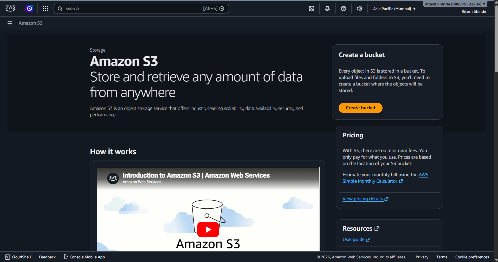
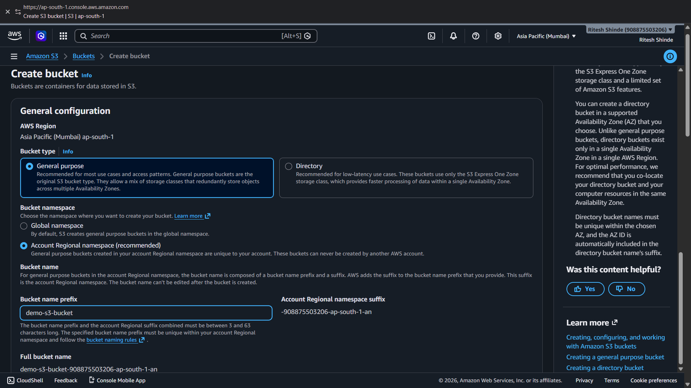
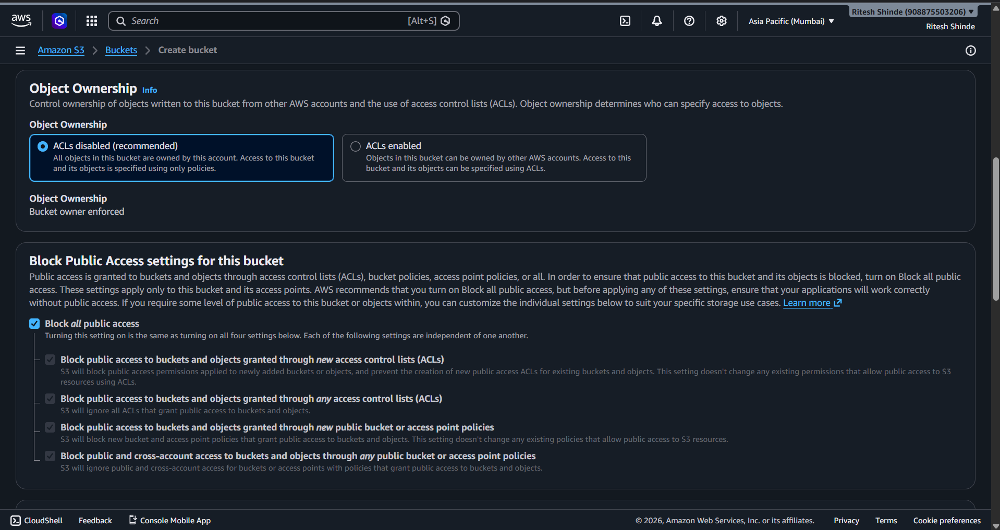
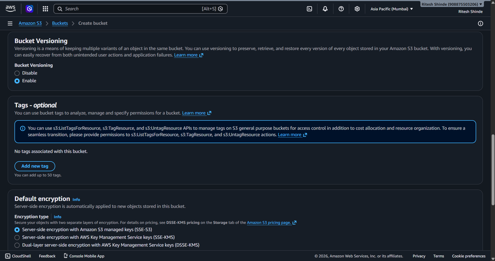
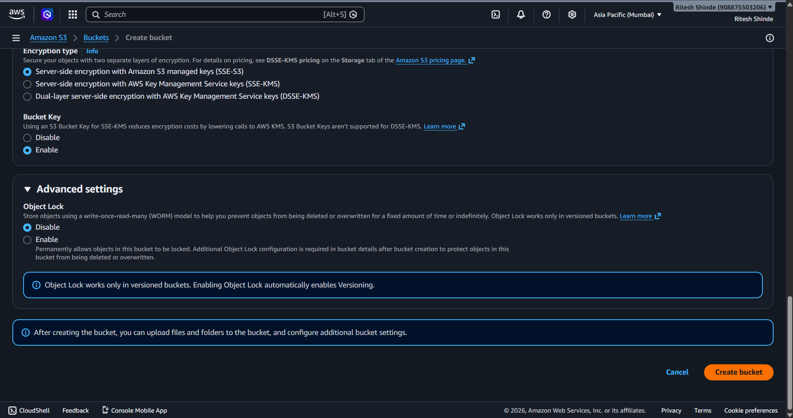
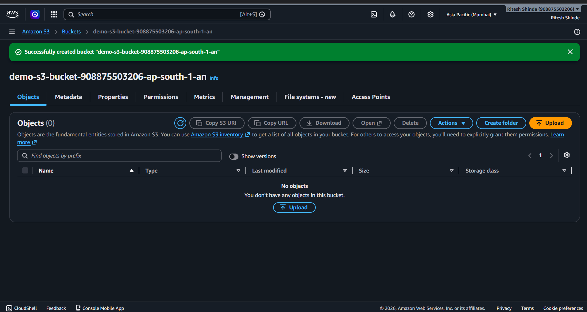
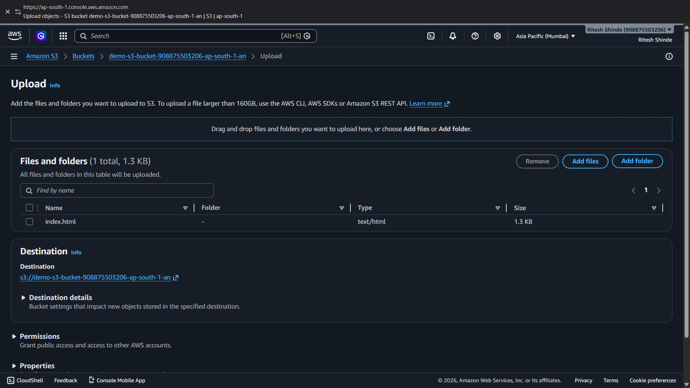
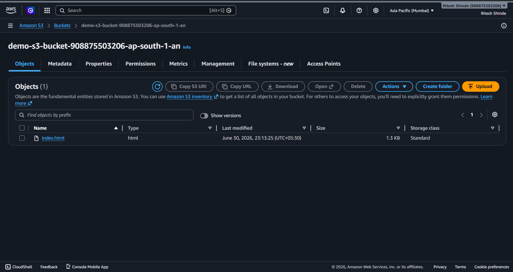

# Lab 04: Amazon S3 Object Storage Basics and Public Access Security

## 1. Overview

This lab covers Phase 4 of the AWS Cloud Infrastructure project. Before this I only knew S3 as "AWS storage" without understanding how object storage actually works or why so many data leaks happen because of misconfigured buckets. In this lab I went through the core S3 concepts first, then created a bucket with Block All Public Access enabled and uploaded a test file to confirm the setup works as expected.

## 2. Environment Used

* **Cloud Provider:** AWS
* **Region:** Asia Pacific (Mumbai) `ap-south-1`
* **Service:** S3 (Simple Storage Service)

---

## 3. Concepts Learned

* **Object storage basics:** S3 stores data as objects, not as files in a traditional folder system. Every object lives inside a bucket and is identified by a key. There is no real folder structure underneath, what looks like folders in the console is just a naming convention using the key.
* **Bucket policies vs ACLs:** these are the two ways access can be controlled on a bucket. ACLs are the older method and work at a more granular level (per object), while bucket policies are JSON based and apply at the bucket level. AWS recommends bucket policies as the modern approach.
* **Block Public Access settings:** this is a separate safety layer on top of policies and ACLs. Even if a bucket policy is accidentally written to allow public access, Block Public Access can override it and keep the bucket private. AWS made this the default for all new buckets since 2018, before that, public access had to be manually blocked.
* **History of S3 leaks:** looked into a few well known cases where companies exposed customer records, leaked credentials, or left backups public by mistake. Almost all of them traced back to the same root cause, someone either turned off Block Public Access or attached an overly permissive bucket policy without realizing what it actually exposed.

This part mattered more than I expected. Understanding why the leaks happened made locking the bucket down feel less like a checkbox and more like something with a real reason behind it.

---

## 4. Steps

### 4.1 Opening the S3 Service

Started from the Amazon S3 landing page and clicked Create bucket to begin setup.

### 4.2 Naming the Bucket

Entered a unique bucket name prefix while keeping the region set to Asia Pacific (Mumbai). AWS automatically appends a suffix to the prefix to keep the bucket name unique account wide.

### 4.3 Enabling Block All Public Access

Kept Object Ownership set to ACLs disabled and made sure all four Block Public Access settings were checked:

* Block public access through new ACLs
* Block public access through any ACLs
* Block public access through new bucket policies
* Block public access through any bucket policies

This keeps the bucket private by default, no public reads or writes, even if a policy or ACL gets misconfigured later.

### 4.4 Versioning, Tags and Encryption

Enabled Bucket Versioning so older versions of an object can be recovered if something gets overwritten or deleted by mistake. Left tags empty since they were not needed for this lab. Kept default encryption set to Server-side encryption with Amazon S3 managed keys (SSE-S3).

### 4.5 Reviewing Encryption and Advanced Settings

Confirmed the encryption type once more along with the Bucket Key setting, and left Object Lock disabled since it was not needed for this test bucket. Clicked Create bucket to finish setup.

### 4.6 Bucket Created

The bucket was created successfully and showed an empty objects list, confirming everything was set up correctly so far.

### 4.7 Uploading a Test File

Uploaded a simple `index.html` file into the bucket to use as a test object.

### 4.8 Confirming the Upload

After the upload completed, the objects list showed `index.html` sitting inside the bucket.

---

## 5. Verification

Tried accessing the uploaded file through its public object URL directly in the browser. Got an Access Denied response, which confirmed Block Public Access was working as expected and the file was not reachable without proper credentials.

---

## 6. What I Learned

Most S3 leaks I read about were not because of some advanced attack, but because of one setting left unchecked. Block Public Access exists exactly to stop that kind of mistake from happening. Doing this practically made it clear why AWS pushes this as the default now instead of leaving it optional. A bucket should stay private unless there is a specific, deliberate reason to open part of it up, and even then it should be done through a scoped policy, not by disabling the safety net entirely.