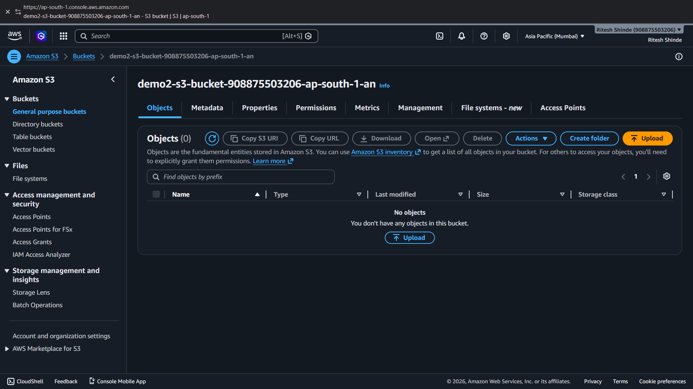
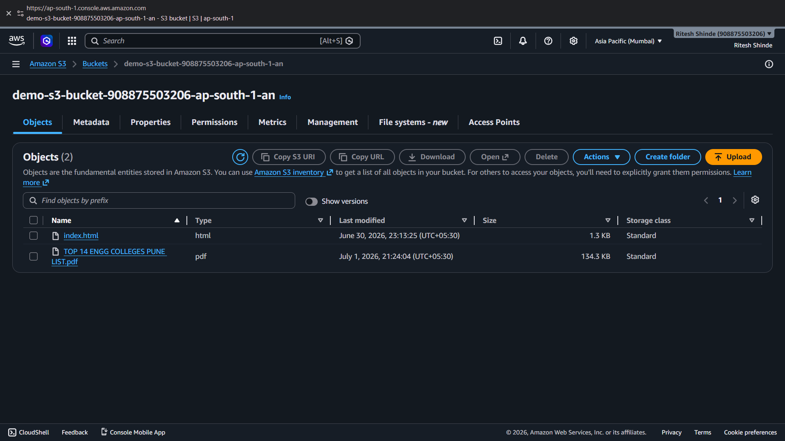
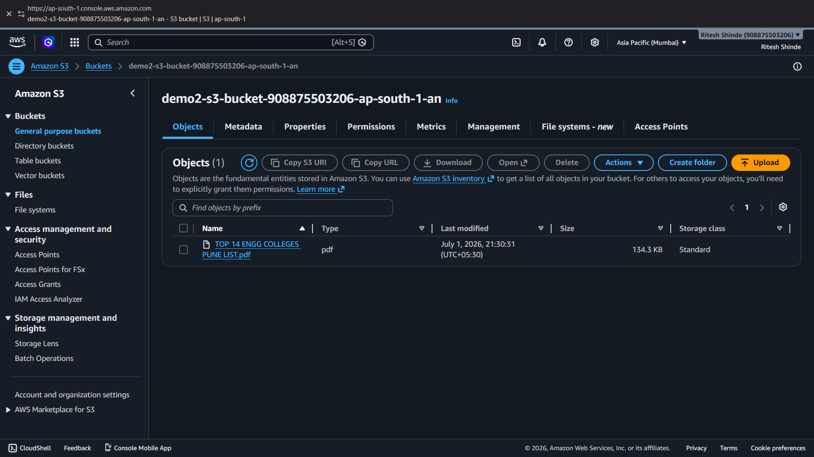
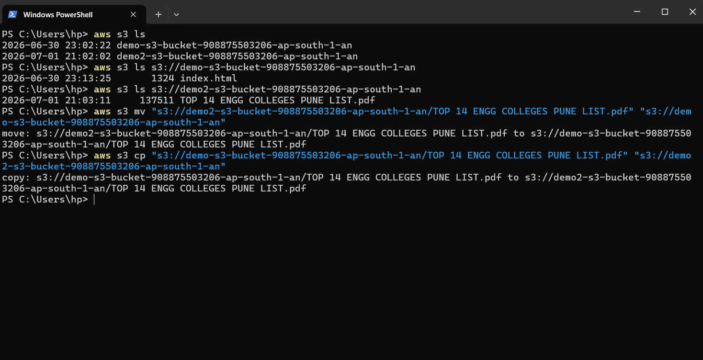

# Lab 05: S3 CLI Operations and Storage Classes

## 1. Overview

This lab covers Phase 5. In the previous lab I created an S3 bucket and uploaded a file through the AWS console. In this lab I practiced managing S3 buckets and objects using the AWS CLI from my local Windows machine. I also went through all 7 S3 storage classes to understand when to use which one and took an overview of how bucket policies work for controlling user access.

## 2. Environment Used

* **Cloud Provider:** AWS
* **Region:** Asia Pacific (Mumbai) `ap-south-1`
* **Service:** S3 (Simple Storage Service)
* **CLI Tool:** AWS CLI (Windows PowerShell)

---

## 3. Concepts Learned

### 3.1 S3 Storage Classes

S3 offers 7 storage classes. Each one is built for a different use case depending on how often you need to access the data and how much you want to spend on storage vs retrieval.

| Storage Class | Best For | Availability | Retrieval Time | Cost |
|---|---|---|---|---|
| **S3 Standard** | Frequently accessed data | 99.99% | Instant | Highest storage cost |
| **S3 Intelligent-Tiering** | Data with unknown or changing access patterns | 99.9% | Instant | Small monitoring fee, auto moves between tiers |
| **S3 Standard-IA** | Infrequently accessed but needs fast retrieval | 99.9% | Instant | Lower storage, retrieval fee applies |
| **S3 One Zone-IA** | Infrequently accessed, non-critical data | 99.5% | Instant | Cheaper than Standard-IA, only one AZ |
| **Glacier Instant Retrieval** | Archive data accessed once a quarter | 99.9% | Milliseconds | Very low storage cost |
| **Glacier Flexible Retrieval** | Archive data accessed once or twice a year | 99.99% | Minutes to hours | Lower than Glacier Instant |
| **Glacier Deep Archive** | Long term archive, rarely accessed | 99.99% | Up to 12 hours | Cheapest of all classes |

The key thing I understood here is that cheaper storage classes always come with either a retrieval cost, a minimum storage duration charge or slower access time. There is always a trade-off.

### 3.2 Bucket Policies

Took an overview of how bucket policies work. A bucket policy is a JSON document attached to a bucket that controls which users or services can do what on the bucket and its objects. You can use it to allow specific IAM users to read objects, deny access from outside a particular VPC or make a specific prefix publicly readable while keeping the rest private.

---

## 4. Steps

### 4.1 Creating a Second Bucket

Created a second bucket `demo2-s3-bucket-908875503206-ap-south-1-an` in the same region and uploaded a PDF file into it to use for CLI operations.

### 4.2 Listing Buckets and Objects via CLI

Used `aws s3 ls` to list all buckets in the account and then listed the contents of each bucket individually.

```bash
aws s3 ls
aws s3 ls s3://demo-s3-bucket-908875503206-ap-south-1-an
aws s3 ls s3://demo2-s3-bucket-908875503206-ap-south-1-an
```

This showed `index.html` in the first bucket and the PDF in the second bucket.

### 4.3 Moving an Object Between Buckets

Used `aws s3 mv` to move the PDF from `demo2` to `demo`. The `mv` command removes the file from the source after copying it to the destination, similar to how cut and paste works.

```bash
aws s3 mv "s3://demo2-s3-bucket-908875503206-ap-south-1-an/TOP 14 ENGG COLLEGES PUNE LIST.pdf" "s3://demo-s3-bucket-908875503206-ap-south-1-an"
```

After this, `demo2` had 0 objects and `demo` had 2 objects.





### 4.4 Copying an Object Between Buckets

Used `aws s3 cp` to copy the PDF back from `demo` to `demo2`. Unlike `mv`, the `cp` command keeps the file in the source and puts a copy in the destination.

```bash
aws s3 cp "s3://demo-s3-bucket-908875503206-ap-south-1-an/TOP 14 ENGG COLLEGES PUNE LIST.pdf" "s3://demo2-s3-bucket-908875503206-ap-south-1-an"
```

After this, both buckets had the PDF.



### 4.5 Full CLI Session

All the commands ran in one PowerShell session.



---

## 5. Verification

After the `mv` command ran, checked the console and confirmed `demo2` showed 0 objects and `demo` showed 2 objects. After the `cp` command ran, `demo2` showed the PDF again. Both matched exactly what the CLI output said.

---

## 6. What I Learned

The difference between `mv` and `cp` is simple but important. `mv` deletes from source after moving, `cp` keeps both copies. In real cloud environments this matters when you are moving objects between storage tiers or regions and need to confirm the transfer succeeded before deleting the original.

The storage class table helped me understand that S3 is not just one flat storage option. Each class is a cost vs access time trade-off and picking the wrong one either wastes money or slows down access when you actually need the data.