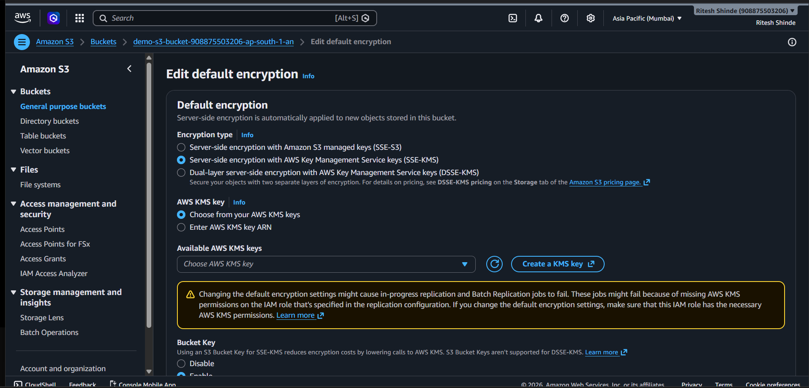
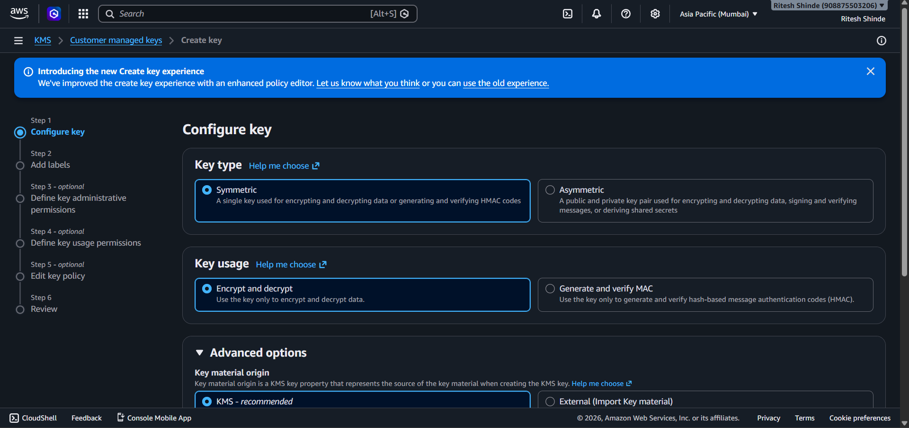
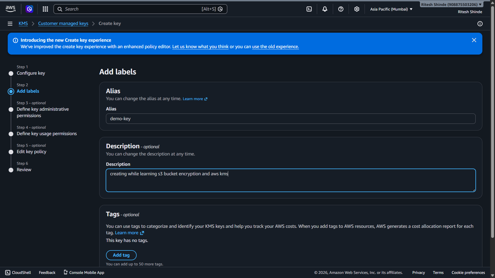
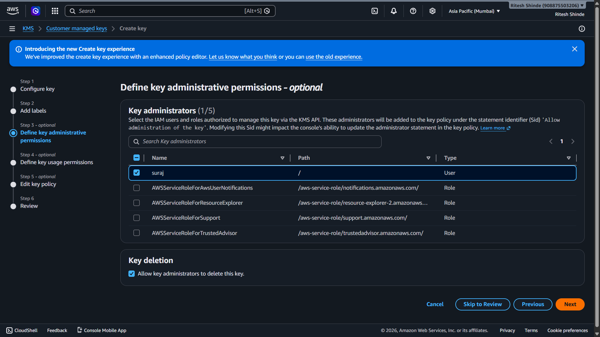
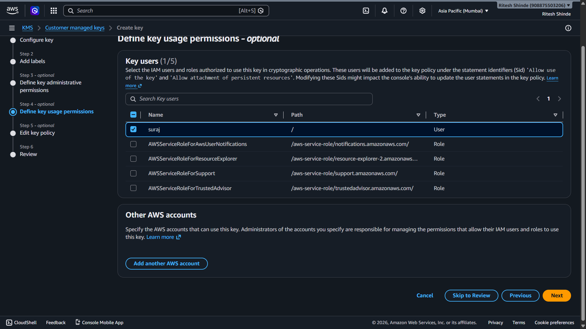
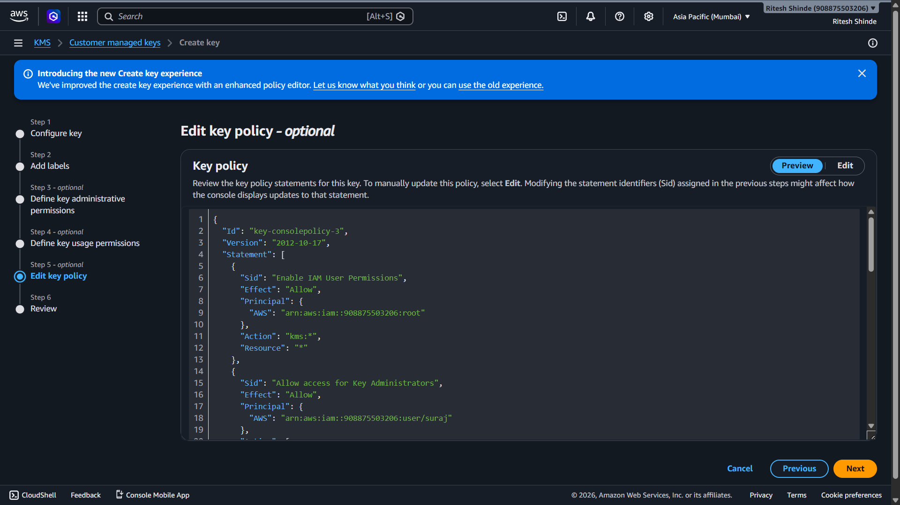
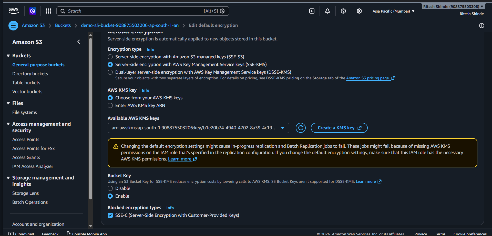

# Lab 08-A: Securing S3 Bucket with KMS Encryption

## 1. Overview

This lab covers Phase 8-A of the AWS Cloud Infrastructure project. In Lab 06 I studied how AWS KMS works conceptually. In this lab I actually put it into practice by creating a real KMS key and using it to encrypt an S3 bucket. Every new object uploaded to the bucket from this point will be encrypted automatically using that key.

## 2. Environment Used

* **Cloud Provider:** AWS
* **Region:** Asia Pacific (Mumbai) `ap-south-1`
* **Services:** AWS KMS and Amazon S3
* **KMS Key Alias:** demo-key
* **Bucket:** demo-s3-bucket-908875503206-ap-south-1-an

---

## 3. What I Did

There were two main parts to this lab. First I created a new KMS key. Then I went into the S3 bucket and changed its default encryption to use that key.

---

## 4. Steps

### 4.1 Configuring the Key Type

Opened AWS KMS and started the Create key flow. Selected **Symmetric** as the key type since this key will be used for both encrypting and decrypting data inside the same account. Set the key usage to **Encrypt and decrypt**. Left the key material origin as **KMS** which means AWS generates and manages the key material internally.



### 4.2 Adding Labels

Gave the key an alias of `demo-key` and added a short description to make it easy to identify later. Left tags empty since this was a learning exercise.



### 4.3 Setting Key Administrative Permissions

In the key administrators section, selected the IAM user `suraj`. A key administrator can manage the key itself, things like enabling, disabling, rotating and deleting it, but this does not automatically mean they can use the key to encrypt or decrypt data. That is a separate permission.



### 4.4 Setting Key Usage Permissions

In the key users section, also selected `suraj`. This allows the user to actually use the key in cryptographic operations like encrypt, decrypt and generate data keys. Both admin and usage permissions were given to the same user here for simplicity in this lab.



### 4.5 Reviewing the Key Policy

Before finishing, reviewed the auto-generated key policy JSON. The policy has four statements:

* **Enable IAM User Permissions** - gives the root account full control over the key as a fallback
* **Allow access for Key Administrators** - gives `suraj` permissions to manage the key lifecycle
* **Allow use of the key** - gives `suraj` permission to use the key for encryption and decryption operations
* **Allow attachment of persistent resources** - lets `suraj` create grants so AWS services like S3 can use the key on their own

```json
{
  "Id": "key-consolepolicy-3",
  "Version": "2012-10-17",
  "Statement": [
    {
      "Sid": "Enable IAM User Permissions",
      "Effect": "Allow",
      "Principal": {
        "AWS": "arn:aws:iam::908875503206:root"
      },
      "Action": "kms:*",
      "Resource": "*"
    },
    {
      "Sid": "Allow access for Key Administrators",
      "Effect": "Allow",
      "Principal": {
        "AWS": "arn:aws:iam::908875503206:user/suraj"
      },
      "Action": [
        "kms:Create*",
        "kms:Describe*",
        "kms:Enable*",
        "kms:List*",
        "kms:Put*",
        "kms:Update*",
        "kms:Revoke*",
        "kms:Disable*",
        "kms:Get*",
        "kms:Delete*",
        "kms:TagResource",
        "kms:UntagResource",
        "kms:ScheduleKeyDeletion",
        "kms:CancelKeyDeletion",
        "kms:RotateKeyOnDemand"
      ],
      "Resource": "*"
    },
    {
      "Sid": "Allow use of the key",
      "Effect": "Allow",
      "Principal": {
        "AWS": "arn:aws:iam::908875503206:user/suraj"
      },
      "Action": [
        "kms:Encrypt",
        "kms:Decrypt",
        "kms:ReEncrypt*",
        "kms:GenerateDataKey*",
        "kms:DescribeKey"
      ],
      "Resource": "*"
    },
    {
      "Sid": "Allow attachment of persistent resources",
      "Effect": "Allow",
      "Principal": {
        "AWS": "arn:aws:iam::908875503206:user/suraj"
      },
      "Action": [
        "kms:CreateGrant",
        "kms:ListGrants",
        "kms:RevokeGrant"
      ],
      "Resource": "*",
      "Condition": {
        "Bool": {
          "kms:GrantIsForAWSResource": "true"
        }
      }
    }
  ]
}
```



### 4.6 Changing the S3 Bucket Default Encryption

Went into the S3 bucket settings and opened Edit default encryption. Changed the encryption type from SSE-S3 to **SSE-KMS**. This means instead of S3 managing the key on its own, the key lives in KMS and S3 asks KMS to handle encryption and decryption for every object.

Also noticed that once SSE-KMS is selected, the console automatically checks the **Block SSE-C** option at the bottom. This is a good security practice since SSE-C lets users bring their own keys from outside AWS which is harder to audit and control.



### 4.7 Selecting the KMS Key

Selected `demo-key` from the available KMS keys dropdown and saved the changes. From this point every new object uploaded to the bucket will be encrypted using this key automatically without needing to do anything extra during upload.



---

## 5. Key Configuration Summary

| Setting | Value |
|---|---|
| Key type | Symmetric |
| Key spec | SYMMETRIC_DEFAULT |
| Key usage | Encrypt and decrypt |
| Origin | AWS KMS |
| Regionality | Single-Region key |
| Alias | demo-key |
| Key administrator | suraj |
| Key user | suraj |
| Bucket encryption | SSE-KMS |
| SSE-C blocked | Yes |

---

## 6. What I Learned

The difference between SSE-S3 and SSE-KMS became very clear here. With SSE-S3, S3 manages the encryption key itself and you have no control over who can use that key or when. With SSE-KMS, the key lives in KMS and access to it is controlled through a key policy just like any other IAM policy. This means you can restrict which users or services can decrypt objects in the bucket simply by controlling who has access to the KMS key, without touching the bucket policy at all.

The fact that blocking SSE-C gets enforced automatically when you switch to SSE-KMS is also an important detail. It means no one can bypass your KMS-based encryption by uploading objects with their own external key.