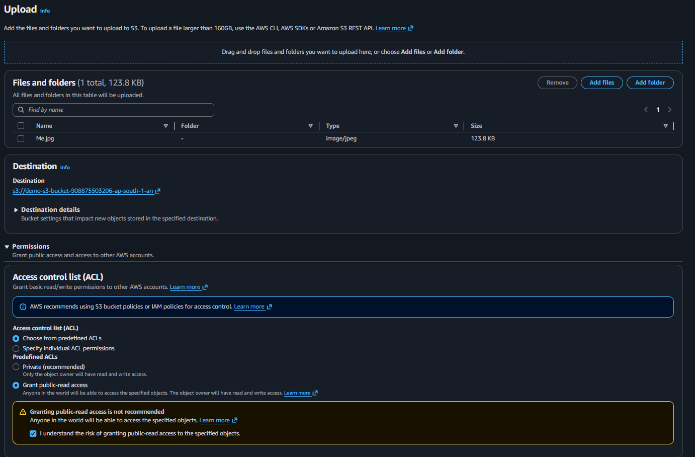
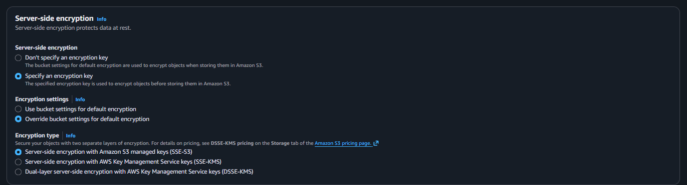
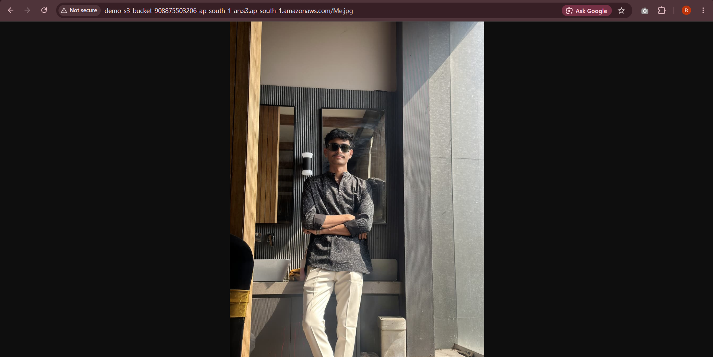
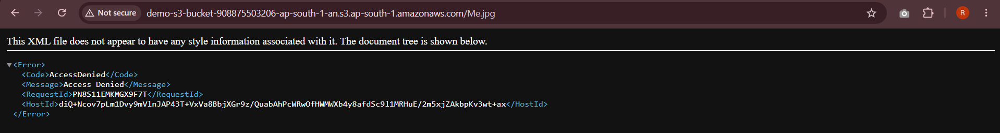

# Lab 08-B: S3 In-Transit Encryption and HTTPS Enforcement

## 1. Overview

This lab covers Phase 8-B of the AWS Cloud Infrastructure project. Lab 08-A covered encryption at rest using KMS. This lab covers the other side of the same problem: encryption in transit. Data at rest being encrypted means nothing if someone can intercept it while it is moving over the network. In this lab I proved that an S3 object is accessible over plain HTTP by default, then wrote a bucket policy that blocks all HTTP requests and forces HTTPS only.

## 2. Environment Used

* **Cloud Provider:** AWS
* **Region:** Asia Pacific (Mumbai) `ap-south-1`
* **Service:** Amazon S3
* **Bucket:** demo-s3-bucket-908875503206-ap-south-1-an
* **Test File:** Me.jpg

---

## 3. Concepts

**Encryption at rest vs encryption in transit:**

* **At rest** means the data is encrypted while sitting in storage. Lab 08-A covered this using KMS.
* **In transit** means the data is encrypted while moving between the client and the server. This is done using HTTPS (TLS). If someone uses plain HTTP, the data travels unencrypted and can be intercepted by anyone on the same network.

By default S3 does not block HTTP requests. Anyone with the object URL can access it over HTTP unless a bucket policy explicitly denies it. The `aws:SecureTransport` condition in a bucket policy is the standard way to enforce HTTPS only.

---

## 4. Steps

### 4.1 Uploading the Test File with Public Read Access

First enabled public access on the bucket. Then uploaded `Me.jpg` with the ACL set to **Grant public-read access** so the file would be reachable from a browser without any credentials.



### 4.2 Setting Per-Object Encryption During Upload

During the upload, expanded the server-side encryption section and selected **Specify an encryption key** with **Override bucket settings for default encryption**. Set the encryption type to **SSE-S3** so the object is encrypted at rest using S3 managed keys. This setting only covers at-rest encryption and has no effect on whether the object can be accessed over HTTP.



### 4.3 Accessing the File Over HTTP

Took the object URL and opened it in the browser using plain `http://`. The image loaded without any problem. This confirmed that even though the object is encrypted at rest, there was nothing stopping someone from fetching it over an unencrypted connection.



### 4.4 Adding the HTTPS Enforcement Bucket Policy

Went into the bucket's **Permissions** tab and added the following bucket policy. It has two statements:

* **AllowPublicRead** - allows anyone to read objects in the bucket
* **EnforceHTTPSOnly** - denies all S3 actions on the bucket and its objects when `aws:SecureTransport` is false, meaning the request came in over HTTP instead of HTTPS

```json
{
    "Version": "2012-10-17",
    "Statement": [
        {
            "Sid": "AllowPublicRead",
            "Effect": "Allow",
            "Principal": "*",
            "Action": "s3:GetObject",
            "Resource": "arn:aws:s3:::demo-s3-bucket-908875503206-ap-south-1-an/*"
        },
        {
            "Sid": "EnforceHTTPSOnly",
            "Effect": "Deny",
            "Principal": "*",
            "Action": "s3:*",
            "Resource": [
                "arn:aws:s3:::demo-s3-bucket-908875503206-ap-south-1-an",
                "arn:aws:s3:::demo-s3-bucket-908875503206-ap-south-1-an/*"
            ],
            "Condition": {
                "Bool": {
                    "aws:SecureTransport": "false"
                }
            }
        }
    ]
}
```

The key thing here is that an explicit **Deny** always wins over any **Allow** in AWS. So even though `AllowPublicRead` is there, the Deny from `EnforceHTTPSOnly` kicks in first when the request comes over HTTP and blocks it.

### 4.5 Testing HTTP Access After the Policy

Tried opening the same HTTP URL again in the browser. This time it returned an **Access Denied** XML error. The object still exists and is still publicly readable over HTTPS, but plain HTTP is now completely blocked at the policy level.



---

## 5. What I Learned

Before this lab I thought public S3 access meant anyone could reach the object no matter what. This lab showed that you can still have a publicly readable object while enforcing that it must only be accessed over a secure connection. The `aws:SecureTransport` condition is the standard way to do this and it works at the bucket policy level so it covers the entire bucket without touching individual object settings.

The most important thing I understood here is the relationship between the two statements in the policy. The Allow and the Deny can coexist in the same policy. The Deny does not cancel the Allow for HTTPS requests, it only activates when the condition is true, meaning when `SecureTransport` is false. So HTTPS requests still go through fine.