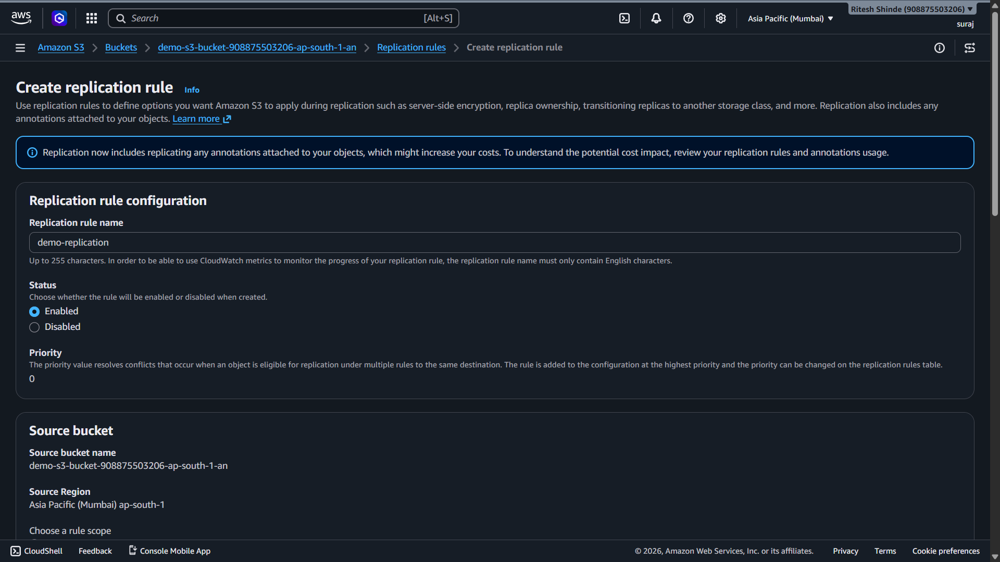
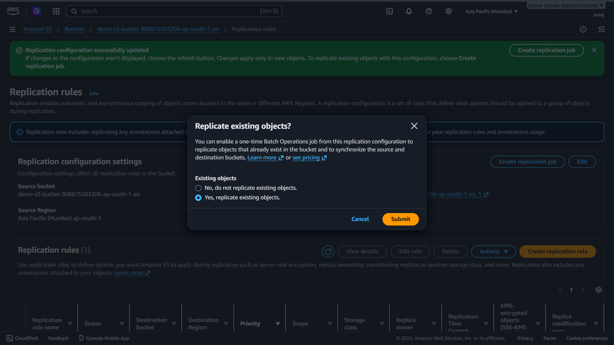
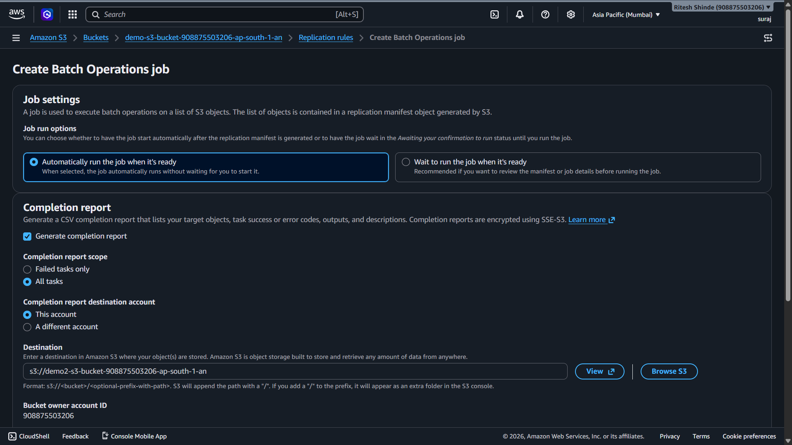
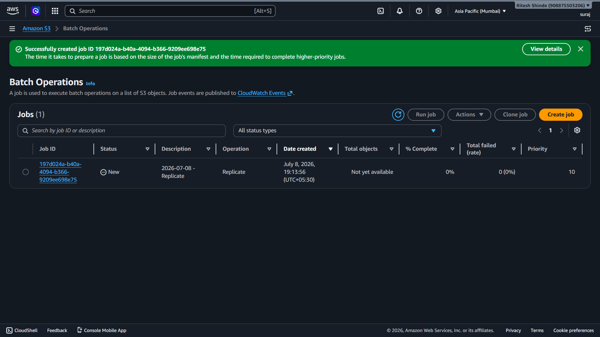
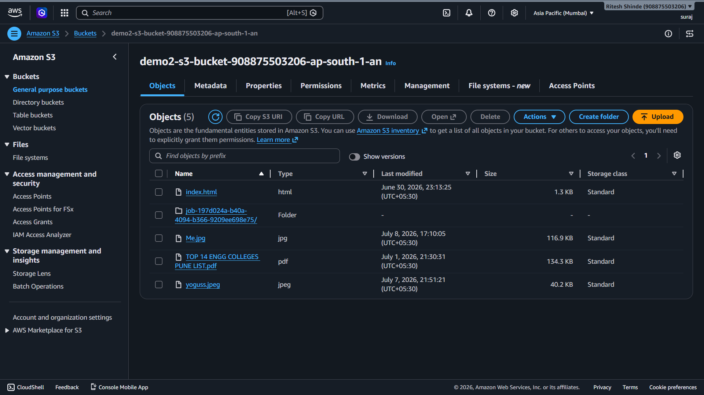

# Lab 08 C: S3 Versioning and Bucket Replication

## 1. Overview

This lab covers Phase 8-C of the AWS Cloud Infrastructure project. This lab has two parts. The first part is about S3 versioning, where I uploaded a modified version of an existing object and checked both the old and new versions through their URLs. The second part is about bucket replication, where I set up automatic copying of objects from one bucket to another using a replication rule.

## 2. Environment Used

* **Cloud Provider:** AWS
* **Region:** Asia Pacific (Mumbai) `ap-south-1`
* **Service:** Amazon S3
* **Source Bucket:** demo-s3-bucket-908875503206-ap-south-1-an
* **Destination Bucket:** demo2-s3-bucket-908875503206-ap-south-1-an

---

## 3. Part 1 - S3 Versioning

### 3.1 Why Versioning Matters

Versioning keeps every version of an object in a bucket instead of overwriting the old one when a new file is uploaded with the same name. This matters in real environments for a few reasons:

* **Accidental overwrites:** If someone uploads a wrong file or corrupts an existing one, the old version is still there and can be restored without any backup system.
* **Accidental deletes:** When you delete a versioned object, S3 adds a delete marker instead of actually removing the data. The object can still be recovered by removing the marker.
* **Audit trail:** You can see the full history of changes to an object over time which matters in compliance-heavy environments.

**Security flaws to be aware of:**

* Versioning increases storage costs since every version of every object is stored separately. In a large bucket with frequent updates, costs can grow fast without a lifecycle policy to clean up old versions.
* Old versions may contain sensitive data that was intentionally removed from the latest version. If access control is not applied to old versions specifically, they can still be accessed by anyone with the right URL.
* A delete marker can create a false sense of security. The object looks deleted in the console but the data is still there and accessible if someone knows the version ID.

**Real life scenarios:**

* A developer accidentally overwrites a production config file. Versioning lets the team restore the previous working version in seconds instead of scrambling to find a backup.
* A company is audited and needs to prove what a file contained six months ago. Versioning gives them access to the exact version from that point in time.
* A ransomware attack encrypts all objects in a bucket. If versioning is enabled, the originals can be recovered by deleting the encrypted versions and restoring the clean ones.

### 3.2 Testing Versioning with Me.jpg

Versioning was already enabled on `demo-s3-bucket-908875503206-ap-south-1-an` when the bucket was created in Lab 04. So both versions were stored automatically without any extra setup needed here.

Yesterday `Me.jpg` was uploaded as the first version. Today I edited the same image, changed its background to blur and uploaded it again with the same filename. S3 stored the new file as the latest version while keeping the original.

**What I checked:**

* Opened the object URL in the browser - it showed the blurred background version (latest)
* Switched to the previous version ID in the console and opened that URL - it showed the original image
* Both URLs were different because each version has its own unique version ID attached to the key

---

## 4. Part 2 - Bucket Replication

### 4.1 What Replication Does

Replication automatically copies objects from a source bucket to a destination bucket whenever a new object is uploaded or an existing one is changed. It works asynchronously in the background without any manual action needed after the rule is set up.

**Why it is useful:**

* **Backup:** A separate copy of data exists in a different bucket, useful if the source bucket gets accidentally deleted or corrupted.
* **Compliance:** Some regulations require data to be stored in multiple locations.
* **Cross-region disaster recovery:** If the source region goes down, data is still available in another region. In this lab both buckets are in the same region but the same concept applies across regions.

### 4.2 Enabling Versioning on the Destination Bucket

Replication requires versioning to be enabled on both the source and destination bucket. The source already had it on. Before setting up the replication rule, I enabled versioning on `demo2-s3-bucket-908875503206-ap-south-1-an` as well.

### 4.3 Creating the Replication Rule

Went into the source bucket's **Management** tab and created a new replication rule with these settings:

* **Rule name:** demo-replication
* **Status:** Enabled
* **Scope:** Apply to all objects in the bucket
* **Destination:** demo2-s3-bucket-908875503206-ap-south-1-an (same account)
* **Destination region:** Asia Pacific (Mumbai) ap-south-1
* **IAM role:** Create new role (S3 creates a role automatically with the right permissions to read from source and write to destination)

### 4.4 Replicate Existing Objects Prompt

After saving the replication rule, S3 asked whether to replicate objects that were already in the bucket before the rule was created. Replication by default only applies to new objects going forward. To also copy existing objects a Batch Operations job is needed.

Selected **Yes, replicate existing objects** and clicked Submit.

### 4.5 Batch Operations Job Settings

The console opened a Create Batch Operations job page to handle copying the existing objects. Configured it with:

* **Job run:** Automatically run when ready
* **Completion report:** Generate for all tasks
* **Report destination:** s3://demo2-s3-bucket-908875503206-ap-south-1-an
* **IAM role:** Create new role

This job goes through all existing objects in the source bucket and copies them to the destination, the same way the replication rule will handle new objects going forward.

### 4.6 Batch Job Created

The job was created successfully with status **New**. It will automatically run once the replication manifest is ready.

### 4.7 Destination Bucket After Replication

After the batch job completed, the destination bucket showed all the objects that were in the source bucket, confirming the replication worked correctly.

---

## 5. What I Learned

Versioning and replication solve two different problems. Versioning protects against accidental changes and deletes within the same bucket by keeping a history of every object. Replication protects against bucket-level loss by maintaining a live copy in a separate bucket.

One thing that stood out is that replication only handles new objects by default. Without the Batch Operations job, all the existing objects would have been left out and the destination bucket would only have received objects uploaded after the rule was created. That is easy to miss and would give a false sense of complete backup.

The other important detail is the IAM role that gets created automatically. S3 cannot just copy objects between buckets without permission to read the source and write to the destination. The auto-created role handles that, but in a real environment you would want to review what permissions that role actually has before trusting it.