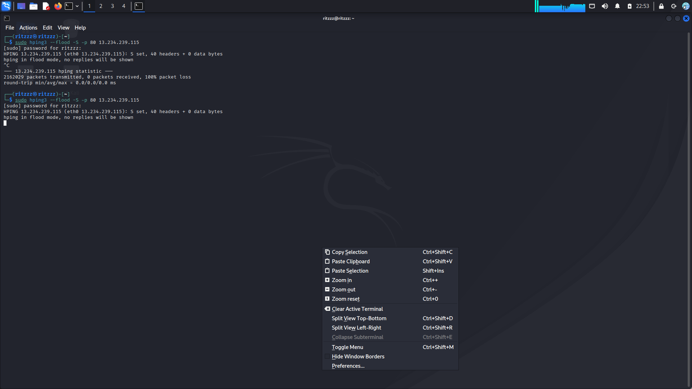
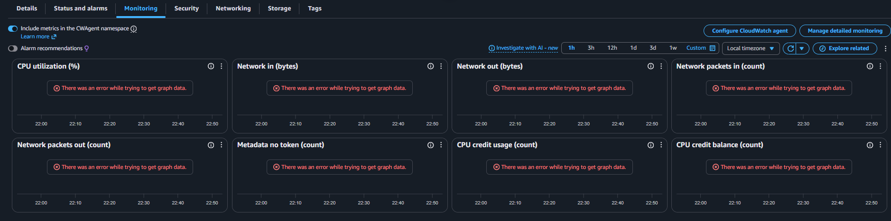
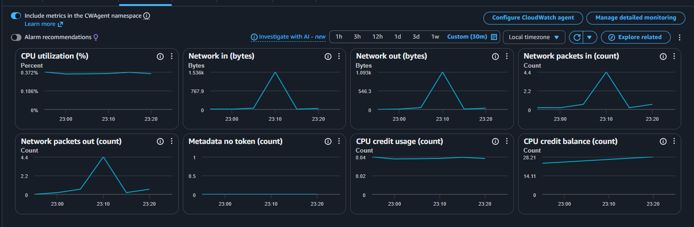
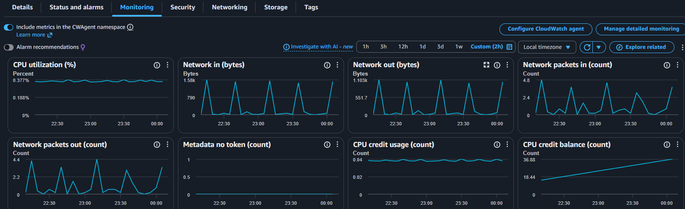

# Network Security Lab: TCP SYN Flood Simulation (hping3 vs AWS EC2)

## Overview
This lab simulates a Layer 4 TCP SYN flood against an AWS EC2 instance running Apache, to see how the attack affects a local machine versus cloud infrastructure, and how it shows up in CloudWatch metrics.

## Setup
- **Target:** AWS EC2 t3.micro (Amazon Linux 2023, 1 vCPU, 1 GiB RAM) running Apache (httpd) on port 80
- **Target IP:** 13.234.239.115
- **Attacker:** Kali Linux, using `hping3` to send a SYN flood
- **Monitoring:** CloudWatch EC2 default metrics

## Preliminary Step: Security Group Configuration
Before running any traffic, I created a security group and attached it to the instance, allowing all ICMP requests so I could confirm the instance was reachable with a basic ping before moving on to the actual test.

## What Happened

I ran the flood 3-4 times total to get a clean result. First couple of attempts didn't go as planned.

### Attempt 1: Kali hangs mid-flood
Command: `sudo hping3 --flood -S -p 80 13.234.239.115`

First run looked fine at first, but the Kali VM itself locked up under its own outgoing traffic. trid Ctrl+C to get out of it, but not worked. Finally restarted the VM. The stats confirmed it: 100% packet loss, meaning nothing was even getting replies back, the local interface was just choking on outbound volume.

*Figure 1: hping3 flood attempts, second one hangs the terminal after 100% packet loss on the first.*

While running the DoS, CloudWatch failed to load graph data twice. This only happened during the attack windows, not during normal/idle state. Likely the burst was too disruptive for the metrics agent to sample cleanly in that window.

*Figure 2: CloudWatch metrics erroring out during the attack window, this didn't happen when the instance was idle.*

### Attempt 2-3: Successful spikes
After restarting the attack a couple more times (without letting it run unthrottled long enough to choke the local machine again), CloudWatch picked up clear traffic spikes.

*Figure 3: CloudWatch showing a clean spike in Network In/Out and CPU credit balance holding steady at 28.21.*

### Attempt 4: Repeated bursts
Ran it a few more times back to back. CloudWatch shows multiple distinct peaks across the window, basically one spike per attempt.

*Figure 4: Multiple flood attempts showing as repeated spikes, CPU credit balance climbing from 18.44 to 36.88 since the instance was barely using any.*

## Metrics Observed
- **Network In/Packets In:** Sharp spikes each time confirming packets hit the EC2 NIC
- **Network Out/Packets Out:** Mirrored the inbound pattern EC2 was responding with SYN-ACKs
- **CPU Utilization:** Stayed flat (~0.37%) since SYN handling happens in kernel space, not application-level
- **CPU Credit Balance:** Kept climbing through the test, confirming the instance was idle CPU-wise and well within Free Tier limits

## An Unexpected Side Effect: My Own IP Got Blocked

After the last flood attempt, which ran for about 2-3 minutes straight, the site stopped loading from the same wifi/IP I used to send the attack. Other devices on a different wifi could still open the site fine, so the instance itself wasn't down.

I was using a mobile hotspot for this. Turning on airplane mode and then turning it off changed my phone's IP, and the site started loading again right after that. Since nothing changed except my IP, this means the block was tied to my IP specifically.

I never set up any blocking rule myself, so this was most likely AWS Shield Standard, which runs automatically on every EC2 instance with no setup needed. It looks like it picked up on the abnormal traffic pattern from my IP and quietly blocked or limited it at the network level, without me seeing anything about it in the AWS console.

This ended up being a good real-world confirmation that AWS's basic DDoS protection works on its own, even without configuring anything extra.

## Takeaways
- Cloud servers can handle a lot more flood traffic than a local machine. My own laptop choked before AWS did, more than once.
- A real flood can still fill up the connection table on the server and take Apache down for a while. It comes back either when the connections time out on their own, or after running `sudo systemctl restart httpd`.
- My own attacking IP got auto-blocked after the last flood, likely by AWS Shield Standard, even though I never configured any blocking myself.
- Ways to actually defend against this in production:
  - **AWS Shield Standard**: basic protection AWS gives you by default
  - **Security Groups / NACLs**: limit which IPs can send traffic, or rate-limit it
  - **ALB**: sits in front of the server and absorbs the connections before they reach it